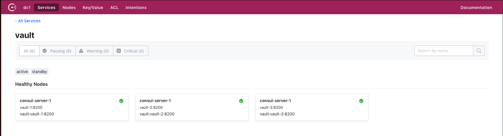
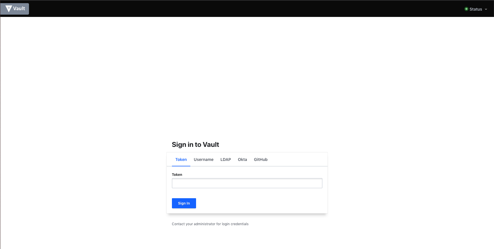

# Vault Cluster Playground

## Description
This repository contains docker-compose file and couples of config files to run a Vault cluster and play with it.
I create this be able to test upgrade procedure.

## Components
This deployment is composed of the following services:
- Consul (in dev mode)
- 3 Vault
- Nginx

## Run
To run this just run the following command:
```
docker-compose up
```

```
docker-compose -d up
```

## Vault initialisation
After the 1st boot Vault need to initialised.
Pick up any Vault container and run the following command:

```
vault operator init \
  -recovery-shares=1 \
  -recovery-threshold=1 \
  -key-shares=1 \
  -key-threshold=1 \
  -format=json
```

You need write the unseal key has you will need it for the next step.

Once Vault is initialised you need to unseal it, on all 3 Vault instances run:
```
vault operator unseal <UNSEAL KEY>
```

You are done.

## Usage
Add the following to your `/etc/hosts`:
```
127.0.0.1 vault.local
```

You can now play with Vault:
```
curl -s http://vault.local/v1/sys/health | jq
{
  "initialized": true,
  "sealed": false,
  "standby": true,
  "performance_standby": false,
  "replication_performance_mode": "disabled",
  "replication_dr_mode": "disabled",
  "server_time_utc": 1582220893,
  "version": "1.0.0",
  "cluster_name": "vault-cluster-d470fef7",
  "cluster_id": "d49e9609-b977-5572-31f9-14f710527d9b"
}
```

```
vault status
Key                    Value
---                    -----
Seal Type              shamir
Initialized            true
Sealed                 false
Total Shares           1
Threshold              1
Version                1.0.0
Cluster Name           vault-cluster-d470fef7
Cluster ID             d49e9609-b977-5572-31f9-14f710527d9b
HA Enabled             true
HA Cluster             https://vault-1:8201
HA Mode                standby
Active Node Address    http://vault-1:8200
```

## UI
Once all the containers are up, you can access Consul here: http://localhost:8500



Vault here: http://vault.local


